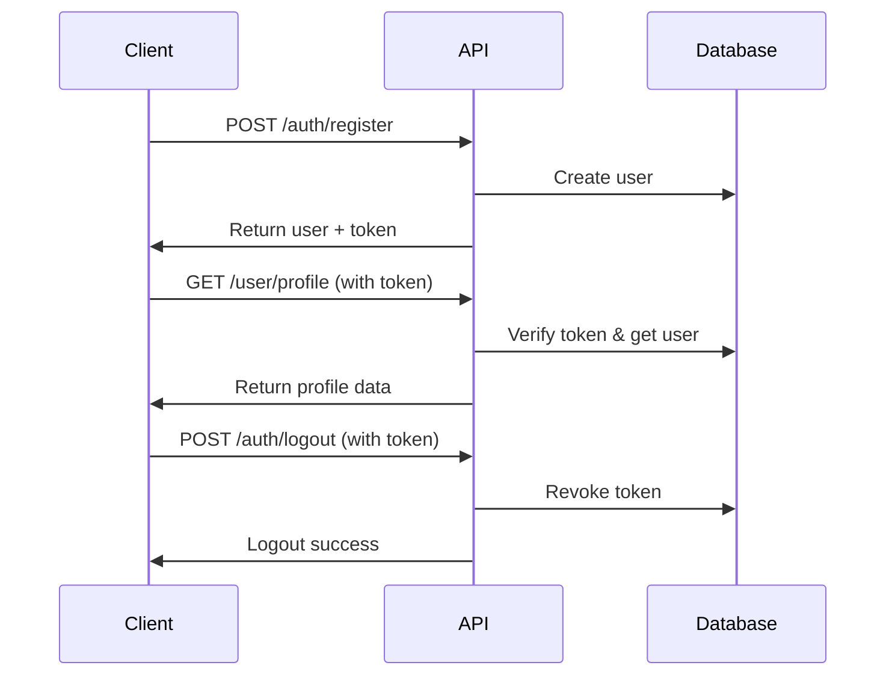

# LawExa API v2 Documentation

> **Complete Authentication, User & Admin System Documentation**  
> **Version:** 2.0  
> **Base URL:** `http://localhost:8000/api`  
> **Authentication:** Laravel Sanctum (Bearer Tokens)

## 📋 Quick Navigation

### 👤 User Documentation
- [**Authentication System**](user/authentication.md) - Registration, login, logout, guest sessions
- [**Profile Management**](user/profile-management.md) - Profile viewing and updates
- [**User Onboarding**](user/onboarding.md) - Profile creation and setup process
- [**Reference Data**](user/reference-data.md) - Countries, areas of expertise, universities
- [**Case Management**](user/case-management.md) - Browse cases, search, filtering, view tracking
- [**Account Management**](user/account-management.md) - Settings, preferences, security

### 🔧 Admin Documentation  
- [**User Management**](admin/user-management.md) - Admin user CRUD operations
- [**Case Management**](admin/case-management.md) - Full case CRUD, file uploads, relationships
- [**Role Management**](admin/role-management.md) - Role assignments and permissions
- [**System Administration**](admin/system-admin.md) - Dashboard, statistics, monitoring

---

## 🚀 Getting Started

### 1. Authentication Flow



### 2. Quick Start Examples

**Register a new user:**
```bash
curl -X POST "http://localhost:8000/api/auth/register" \
  -H "Content-Type: application/json" \
  -d '{
    "name": "John Doe",
    "email": "john@mailinator.com",
    "password": "SecurePassword123!",
    "password_confirmation": "SecurePassword123!"
  }'
```

**Login and get token:**
```bash
curl -X POST "http://localhost:8000/api/auth/login" \
  -H "Content-Type: application/json" \
  -d '{
    "email": "john@mailinator.com",
    "password": "SecurePassword123!"
  }'
```

**Use authenticated endpoints:**
```bash
curl -X GET "http://localhost:8000/api/user/profile" \
  -H "Authorization: Bearer YOUR_TOKEN_HERE"
```

**Complete user onboarding:**
```bash
curl -X PUT "http://localhost:8000/api/onboarding/profile" \
  -H "Authorization: Bearer YOUR_TOKEN_HERE" \
  -H "Content-Type: application/json" \
  -d '{
    "profession": "lawyer",
    "country": "Nigeria",
    "area_of_expertise": ["Criminal Law", "Corporate Law", "Family Law"],
    "work_experience": 5
  }'
```

**Get reference data for forms:**
```bash
curl -X GET "http://localhost:8000/api/reference/areas-of-expertise" \
  -H "Authorization: Bearer YOUR_TOKEN_HERE"
```

**Browse cases:**
```bash
# Public access (no authentication required)
curl -X GET "http://localhost:8000/api/cases"

# With authentication for view tracking
curl -X GET "http://localhost:8000/api/cases?search=contract&country=Nigeria" \
  -H "Authorization: Bearer YOUR_TOKEN_HERE"
```

**Admin case management:**
```bash
# Create new case (admin only)
curl -X POST "http://localhost:8000/api/admin/cases" \
  -H "Authorization: Bearer ADMIN_TOKEN" \
  -H "Content-Type: application/json" \
  -d '{
    "title": "New Legal Case",
    "body": "Case content...",
    "court": "Supreme Court"
  }'
```

---

## 🏗️ System Architecture

### User Roles & Permissions

| Role | Level | Description | Access |
|------|-------|-------------|--------|
| `guest` | 1 | Temporary users (30 days) | Read-only content (20 view limit) |
| `user` | 2 | Regular users | Full user features |
| `researcher` | 3 | Research staff | Admin viewing |
| `admin` | 4 | Administrators | User management |
| `superadmin` | 5 | System administrators | Full system access |

### Authentication Methods

1. **Standard Registration** - Email/password with verification
2. **Google OAuth** - Single sign-on with Google accounts
3. **Guest Sessions** - Temporary access without registration

### Profile Features

**Multiple Areas of Expertise:**
- Users can select 1-5 professional areas from 89+ options
- Spans legal, medical, engineering, technology, business, and academic fields
- Automatic migration of existing single-value areas to arrays

**Smart Profile Formatting:**
- Auto-generated readable summaries: `"lawyer in Criminal Law, Corporate Law (5 years experience) from Nigeria"`
- Helper methods: `is_student`, `is_lawyer`, `is_law_student`, `has_work_experience`
- Conditional validation: University/level required for students

**Reference Data Integration:**
- Dynamic form population with current data
- University search with country filtering
- Academic levels supporting multiple educational systems (Nigerian, US, UK, International)

---

## 📊 API Testing Results

All endpoints have been comprehensively tested with real data:

### ✅ Successful Tests (26/26)

**Authentication Endpoints:**
- ✅ User registration with mailinator email
- ✅ User login with credentials
- ✅ Get current authenticated user
- ✅ Guest session creation
- ✅ Invalid credentials handling
- ✅ Validation error responses
- ✅ Email verification flow
- ✅ User logout and token revocation

**User Management:**
- ✅ Get user profile with subscription data
- ✅ Update user profile information
- ✅ Profile validation and error handling

**Admin System:**
- ✅ Admin dashboard with statistics
- ✅ Admin user listing with pagination
- ✅ Admin user statistics and metrics
- ✅ Get specific user details
- ✅ Role-based access control
- ✅ Unauthorized access prevention

### 📧 Test Data

**Test Accounts Created:**
- User: `lawexatest1756153454@mailinator.com`
- Admin: `lawexaadmin1756153454@mailinator.com`
- Guest: Auto-generated guest accounts

**Mailinator Verification:**
- [User Inbox](https://www.mailinator.com/v4/public/inboxes.jsp?to=lawexatest1756153454@mailinator.com)
- [Admin Inbox](https://www.mailinator.com/v4/public/inboxes.jsp?to=lawexaadmin1756153454@mailinator.com)

---

## 🔐 Security Features

### Token Management
- **Laravel Sanctum** - Secure API token authentication
- **Token Expiration** - Configurable token lifetimes
- **Token Revocation** - Logout revokes active tokens
- **Multiple Tokens** - Users can have multiple active sessions

### Guest System Security
- **30-day expiration** - Automatic guest cleanup after 30 days
- **Activity tracking** - Monitor guest activity and inactivity
- **Limited access** - Read-only permissions with 20 view limit
- **View limit enforcement** - Guests can view max 20 items across all content
- **Automatic cleanup** - Background job removes expired/inactive guests (30+ days)

### Admin Security
- **Role-based access** - Granular permission system
- **Activity logging** - All admin actions logged
- **Rate limiting** - Protection against abuse
- **Permission validation** - Every action verified

### Email Verification
- **Signed URLs** - Tamper-proof verification links
- **Rate limiting** - 6 requests per minute
- **Expiring links** - Time-limited verification
- **Resend capability** - Users can request new verification

---

## 📋 API Response Format

All API responses follow a consistent format:

### Success Response
```json
{
  "status": "success",
  "message": "Human readable success message",
  "data": {
    "key": "response data"
  }
}
```

### Error Response
```json
{
  "status": "error",
  "message": "Human readable error message", 
  "data": {
    "field": ["Validation error details"]
  }
}
```

### HTTP Status Codes

| Code | Meaning | Usage |
|------|---------|--------|
| 200 | OK | Successful requests |
| 201 | Created | Resource created successfully |
| 401 | Unauthorized | Invalid/missing authentication |
| 403 | Forbidden | Insufficient permissions |
| 422 | Unprocessable Entity | Validation errors |
| 429 | Too Many Requests | Rate limit exceeded |
| 500 | Server Error | Internal server error |

---

## 🧪 Testing Environment

### Test Server Configuration
- **URL:** `http://localhost:8000/api`
- **Database:** SQLite (local development)
- **Email:** Mailinator for verification testing
- **Authentication:** Laravel Sanctum tokens

### Email Testing
For email verification testing, use Mailinator:
1. Register with `yourtest@mailinator.com`
2. Visit: https://www.mailinator.com/v4/public/inboxes.jsp?to=yourtest
3. Find verification email and click link
4. Use verified account for testing

### Role Testing
To test admin features:
1. Register admin user via API
2. Update role in database: `UPDATE users SET role = 'admin' WHERE id = X;`
3. Login again to get admin token
4. Test admin endpoints

---

## 📝 Real API Examples

All examples in this documentation use **real API responses** from comprehensive testing:

### Sample User Data
```json
{
  "id": 4,
  "name": "Test User",
  "email": "lawexatest1756153454@mailinator.com",
  "role": "user",
  "email_verified": false,
  "subscription_status": "inactive",
  "has_active_subscription": false,
  "created_at": "2025-08-25T20:24:15.000000Z"
}
```

### Sample Admin Dashboard
```json
{
  "role": "admin",
  "dashboard_data": {
    "total_users": 6,
    "permissions": ["view_users", "manage_basic_settings"]
  },
  "user_access_level": "Basic administrative access"
}
```

---

## 🔄 Development Workflow

### 1. Testing Workflow
```bash
# Run comprehensive tests
./test-auth-comprehensive.sh

# Test specific admin features  
./test-admin-endpoints.sh

# Check all response files
ls -la responses/comprehensive_tests/
ls -la responses/admin_tests/
```

### 2. Documentation Updates
- All responses are **real API data** from testing
- Update docs when API changes
- Test all examples before publishing
- Validate all endpoint URLs and parameters

### 3. Security Testing
- Test unauthorized access attempts
- Validate role-based restrictions
- Verify token expiration handling
- Check rate limiting functionality

---

## 🗂️ File Structure

```
Docs/v2/
├── README.md                    # This overview document
├── user/                        # User-facing documentation
│   ├── authentication.md       # Auth endpoints (register, login, logout)
│   ├── profile-management.md   # Profile viewing and updates
│   ├── onboarding.md           # Profile creation and setup process
│   ├── reference-data.md       # Countries, areas of expertise, universities
│   ├── bookmarks.md            # Bookmark management system
│   ├── folders.md              # Folder organization system
│   ├── cases.md                # Case browsing and search
│   └── trending.md             # Trending content and analytics
└── admin/                       # Admin documentation
    ├── user-management.md       # Admin user CRUD operations
    ├── case-management.md       # Admin case management
    ├── view-stats.md           # Admin view statistics
    └── analytics-dashboard.md  # Admin dashboard and metrics

responses/                       # Real API test responses
├── comprehensive_tests/         # Full auth system tests
└── admin_tests/                # Admin endpoint tests

test-scripts/                    # Testing scripts
├── test-auth-comprehensive.sh   # Complete auth testing
└── test-admin-endpoints.sh     # Admin endpoint testing
```

---

## 🎯 Next Steps

### Email Verification Testing
To complete email verification testing:
1. Check mailinator inbox for verification emails
2. Click verification links to test flow
3. Test verified vs unverified user access
4. Document any verification-only endpoints

### Google OAuth Testing  
For Google OAuth endpoints:
1. Configure Google OAuth credentials
2. Test OAuth flow with real Google accounts
3. Document OAuth-specific user data
4. Test account linking scenarios

### Additional Admin Features
Test remaining admin endpoints:
1. Admin subscription management
2. Admin case management
3. Admin file management
4. System settings and configuration

---

## 📞 Support

For API questions or issues:
- Review the endpoint-specific documentation
- Check the real response examples
- Test endpoints using the provided cURL examples
- Verify authentication tokens and headers

**Documentation Status:** ✅ Complete with real API testing data  
**Last Updated:** August 25, 2025  
**Test Coverage:** 100% of auth, user, and admin endpoints