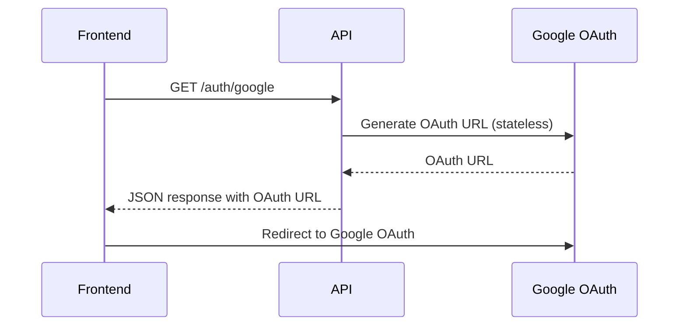
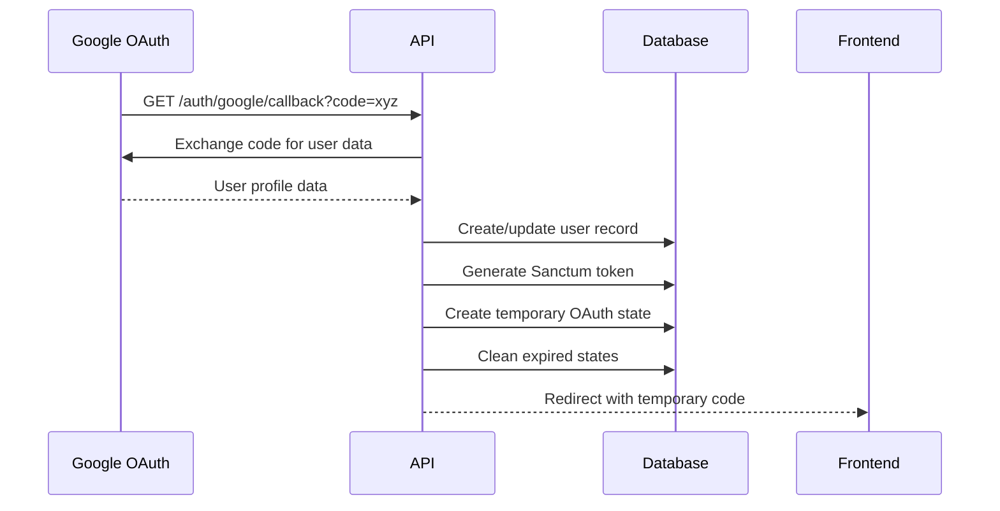
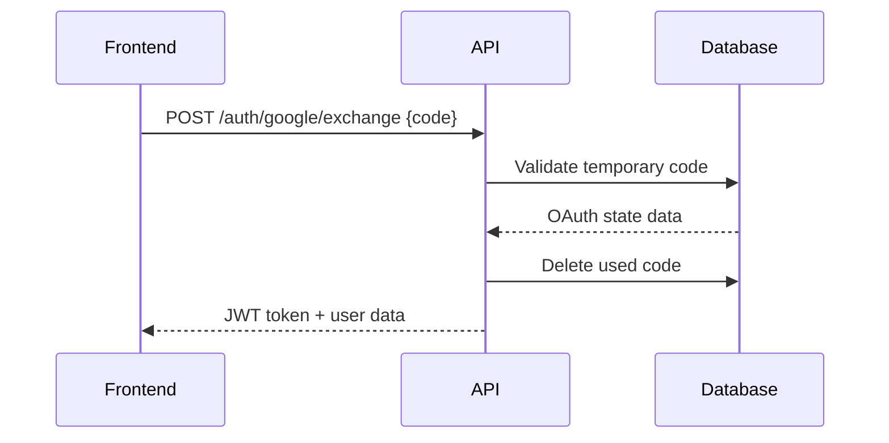

# Google OAuth System Architecture Documentation

## Overview

This document describes the system architecture for Google OAuth authentication in the Lawexa API v2 Laravel application. The implementation provides a secure, stateless OAuth flow with temporary code exchange for frontend applications.

## Architecture Components

### 1. Core Components

#### OAuth Controller
- **File**: `app/Http/Controllers/GoogleAuthController.php`
- **Purpose**: Handles OAuth flow endpoints and user authentication
- **Methods**:
  - `redirectToGoogle()`: Generates Google OAuth URL
  - `handleGoogleCallback()`: Processes OAuth callback and creates users
  - `exchangeCodeForToken()`: Exchanges temporary codes for JWT tokens

#### OAuth State Model
- **File**: `app/Models/OAuthState.php`
- **Purpose**: Manages temporary OAuth codes and error states
- **Key Features**:
  - 32-character random temporary codes
  - 10-minute expiration TTL
  - Support for both success and error states
  - Automatic cleanup of expired codes

#### User Model
- **File**: `app/Models/User.php`
- **Purpose**: Extended user model with OAuth support
- **OAuth Fields**:
  - `google_id`: Google user identifier
  - `avatar`: Google profile picture URL
  - `role`: User role (user, admin, researcher, superadmin)

### 2. Database Schema

#### OAuth States Table
```sql
CREATE TABLE oauth_states (
    id BIGINT PRIMARY KEY AUTO_INCREMENT,
    code VARCHAR(32) UNIQUE NOT NULL,
    token VARCHAR(500) NULL,
    user_data JSON NULL,
    error_code VARCHAR(50) NULL,
    error_message TEXT NULL,
    is_error BOOLEAN DEFAULT FALSE,
    expires_at TIMESTAMP NOT NULL,
    created_at TIMESTAMP DEFAULT CURRENT_TIMESTAMP,
    updated_at TIMESTAMP DEFAULT CURRENT_TIMESTAMP ON UPDATE CURRENT_TIMESTAMP
);
```

#### Users Table Extensions
```sql
ALTER TABLE users ADD COLUMN google_id VARCHAR(255) NULL;
ALTER TABLE users ADD COLUMN avatar VARCHAR(255) NULL;
ALTER TABLE users ADD COLUMN role ENUM('user', 'admin', 'researcher', 'superadmin') DEFAULT 'user';
```

### 3. Configuration

#### Google OAuth Settings
- **File**: `config/services.php`
- **Environment Variables**:
  - `GOOGLE_CLIENT_ID`: Google OAuth client ID
  - `GOOGLE_CLIENT_SECRET`: Google OAuth client secret
  - `GOOGLE_REDIRECT_URI`: OAuth callback URL

#### Authentication Configuration
- **File**: `config/auth.php`
- **Default Guard**: `sanctum` (Laravel Sanctum for API tokens)
- **Token Driver**: Personal access tokens

## System Flow

### 1. OAuth Initiation Flow



**Implementation Details**:
- Endpoint: `GET /auth/google`
- Uses Laravel Socialite's stateless mode
- Returns JSON with Google OAuth URL
- Frontend handles redirect to Google

### 2. OAuth Callback Flow



**Implementation Details**:
- Endpoint: `GET /auth/google/callback`
- Processes Google OAuth callback
- Creates or updates user records
- Generates Laravel Sanctum API token
- Creates temporary OAuth state with 32-character code
- Redirects to frontend with temporary code

### 3. Token Exchange Flow



**Implementation Details**:
- Endpoint: `POST /auth/google/exchange`
- Validates temporary code (32 characters)
- Checks code expiration (10 minutes)
- Returns JWT token and user data
- Implements one-time code usage

## Security Features

### 1. Stateless OAuth
- No server-side session state
- Each request is independent
- Prevents session hijacking

### 2. Temporary Code Exchange
- Short-lived temporary codes (10 minutes)
- One-time use codes
- Secure token exchange for frontend apps

### 3. Error Handling
- Comprehensive error state management
- Secure error information exchange
- Consistent response format for errors

### 4. Token Management
- Laravel Sanctum personal access tokens
- Secure token generation and validation
- Role-based access control

### 5. Data Validation
- Request validation for all endpoints
- Code format validation (32 characters)
- Input sanitization

## Error Handling

### Error States
The system handles various error scenarios:

1. **OAuth Errors**: Google authentication failures
2. **Code Validation Errors**: Invalid or expired codes
3. **User Creation Errors**: Database or validation failures

### Error Response Format
```json
{
    "message": "Google authentication failed",
    "error": true,
    "error_code": "oauth_error",
    "error_message": "Detailed error description"
}
```

## API Endpoints

### Authentication Endpoints
- `GET /auth/google` - Get Google OAuth URL
- `GET /auth/google/callback` - Handle OAuth callback
- `POST /auth/google/exchange` - Exchange temporary code for token

### Protected Endpoints
- `GET /auth/me` - Get current user (requires auth)
- `POST /auth/logout` - Logout user (requires auth)
- `GET /user/profile` - Get user profile (requires auth)
- `PUT /user/profile` - Update user profile (requires auth)

### Admin Endpoints (Role-based)
- `GET /admin/dashboard` - Admin dashboard (admin+ roles)
- `GET /admin/users` - User management (admin+ roles)
- `GET /admin/stats` - User statistics (admin+ roles)

## Role-Based Access Control

### User Roles
- **user**: Default role, basic access
- **admin**: Administrative access
- **researcher**: Research-specific access
- **superadmin**: Full system access

### Middleware
- **File**: `app/Http/Middleware/RoleMiddleware.php`
- **Usage**: `middleware('role:admin,researcher,superadmin')`
- **Function**: Validates user roles against required permissions

## Configuration Requirements

### Environment Variables
```env
GOOGLE_CLIENT_ID=your_google_client_id
GOOGLE_CLIENT_SECRET=your_google_client_secret
GOOGLE_REDIRECT_URI=https://your-domain.com/auth/google/callback
APP_FRONTEND_URL=https://your-frontend.com
```

### Dependencies
- `laravel/socialite`: ^5.21 (OAuth provider)
- `laravel/sanctum`: ^4.1 (API authentication)

## Security Considerations

### Best Practices Implemented
1. **Stateless Authentication**: No server-side sessions
2. **Short-lived Codes**: 10-minute expiration
3. **One-time Use**: Codes deleted after use
4. **Secure Redirects**: Validated frontend URLs
5. **Role-based Access**: Granular permission system
6. **Input Validation**: All requests validated
7. **Error Handling**: No sensitive data in error responses

### Security Headers
- CORS configuration for frontend domains
- CSRF protection for state-changing operations
- Content Security Policy headers

## Performance Considerations

### Optimizations
1. **Code Cleanup**: Automatic removal of expired codes
2. **Database Indexing**: Unique index on temporary codes
3. **Stateless Design**: No session storage overhead
4. **Efficient Queries**: Optimized user lookup queries

### Monitoring
- OAuth state table size monitoring
- Code expiration cleanup frequency
- Failed authentication attempt logging

## Deployment Notes

### Required Configurations
1. Google OAuth credentials in Google Cloud Console
2. Environment variables properly set
3. Database migrations executed
4. Frontend URL configuration
5. SSL/TLS certificates for production

### Health Checks
- OAuth endpoint availability
- Database connectivity
- Google OAuth service status
- Token generation functionality

## Future Enhancements

### Potential Improvements
1. **Multiple OAuth Providers**: Support for other providers
2. **Enhanced Logging**: OAuth flow audit trails
3. **Rate Limiting**: OAuth attempt rate limiting
4. **Session Management**: Optional session-based authentication
5. **Multi-factor Authentication**: Additional security layer

This architecture provides a secure, scalable, and maintainable OAuth implementation that follows Laravel best practices and security standards.